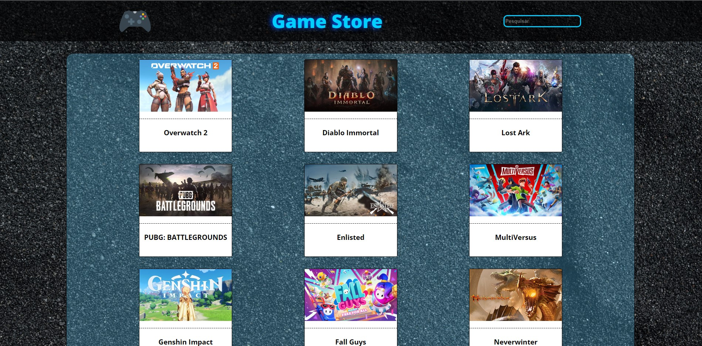
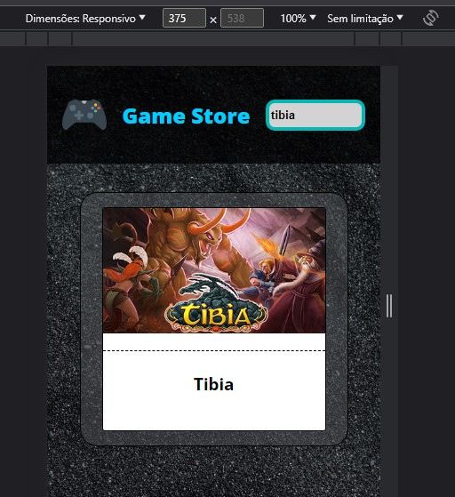

## <h1><em>Olá pessoas!</em>😁</h1> 

<h3>Game Store<h3>

🌟Esse projeto foi desenvolvido para participação de um processo seletivo para a vaga de estagiário Front End React. 
O desafio consistiu em criar uma página web para comunicar e receber dados de uma API, com campo de pesquisa , responsividade para celular, tablet e computadores e por fim a emissão erros na tela caso surja algum na comunicação do front com o servidor.

#
<h3>Prints da aplicação:</h3>

#

🔨 REACT JS

#

⭐️ <a href="https://game-store-taupe.vercel.app/">Deploy</a>

#

<h4>Espero que gostem e acompanhem os novos capítulos!!😎😉</h4>

#

<h5> Minhas redes sociais:</h5>  
    
 
        
         
    

